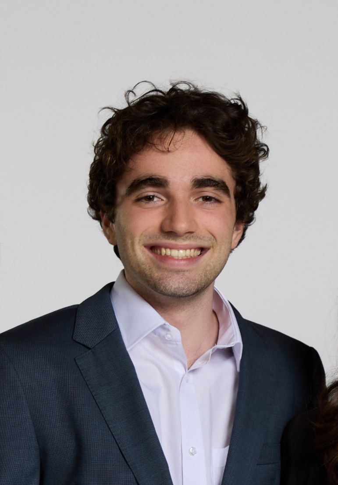

# Tiago Almeida

Hello! I am a Research Intern at the Explainable and Controllable AI Lab working with Dr. Zining Zhu and am currently obtaining my B.S. in Computer Science at Stevens Insitute of Technology. My research areas include model interprability, NeuroAI, and philosophy of AI. Please feel free to reach out to talmeida@stevens.edu!
